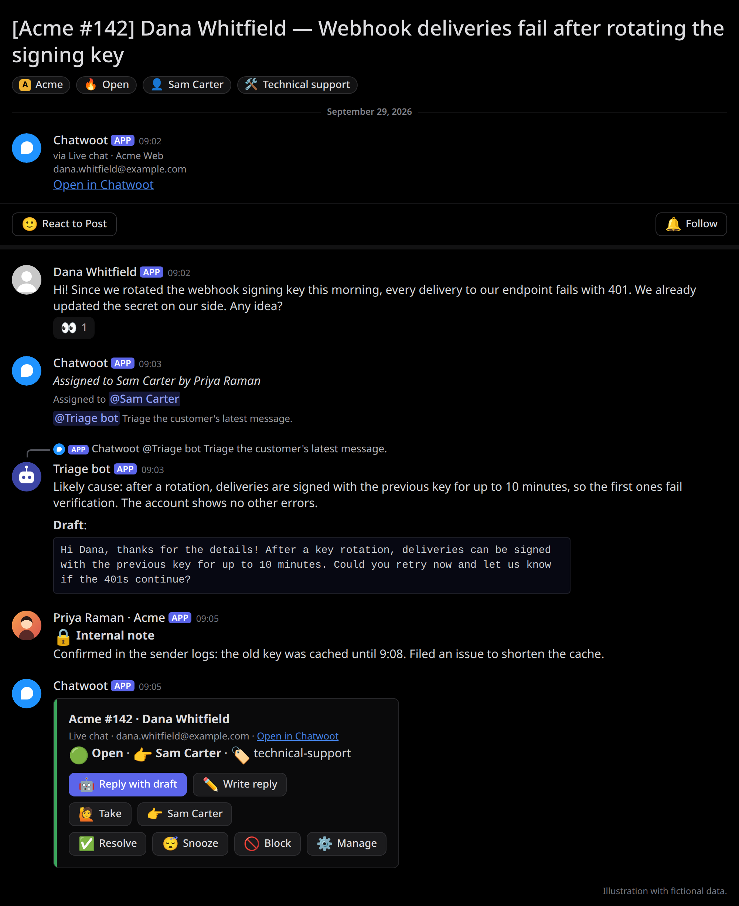

# Connecting an AI agent

chatwoot-discord-relay does not run an AI model. It gives an AI agent (any Discord bot you operate,
called the *triage bot* in the configuration) a place in the ticket workflow: the agent is called
on customer messages, reads the ticket in its forum post, and proposes a reply that a human sends.
This page is the contract such an agent follows.



*Illustration with fictional data.*

## Configuration

Set `triage.userId` in `CONFIG` to the agent's Discord user id. Optional settings (see the
[configuration reference](../README.md#configuration-reference)):

| Key | Default | Meaning |
|---|---|---|
| `triage.name` | `Triage bot` | Name used in the notes posted when the budget is used up. |
| `triage.perConversationPerHour` / `perHour` | `5` / `30` | How many customer messages call the agent, per conversation and in total, each hour. |

The agent's bot needs to see the forum and its posts, read message content there, and send
messages in posts (threads).

## When the agent is called

The relay brings a post up to date in runs: the new messages (customer messages, and with them
what a routing bot did: labels, assignment, status lines), the assignee's announcement, and the
post's card. When a run posted a customer message that calls the agent, the run ends with a
notice of its own that mentions it:

```text
-# <@AGENT_USER_ID> Triage the customer's latest message.
```

The call is the last message of the run, so when the agent sees it, the customer's messages and
everything posted with them are already in the post, and nothing the run posts follows it. A run
with several such customer messages calls the agent once. The agent reads the post's recent
messages to see what to answer (an agent that only reads the message that mentions it sees just
the call). A conversation that is no longer open by the end of the run is not called.

The mention is a literal token in the message content; Discord sends no notification for it
(the relay's `allowed_mentions` leaves it out), so nobody is pinged by it. Only customer
messages call the agent. Agent replies, private notes, activity lines, the ticket header that
opens a post, the post's card (the ticket's state and buttons, with no text content), and
customers' responses to interactive messages (option picks, forms, CSAT ratings) do not. Neither
do automatic email replies (out of office, for example), nor customer messages created more than
`reconcile.lookbackSeconds` (an hour by default) before they are relayed: the history posted when
an older conversation gets its post, or messages caught up after downtime.

When a conversation has had more than `perConversationPerHour` customer messages in the current
hour (UTC clock hour), or all conversations together more than `perHour`, the message gets a note
such as
`-# Triage bot not called: more than 30 customer messages this hour. Ask it here if needed.`
instead of calling the agent. A message counts once, however often its posting is retried.

The agent must:

1. React only to messages in the forum's posts whose content contains its own mention token.
   The relay's webhook (named `Chatwoot`) posts them, so the agent must not ignore messages from
   webhooks or bots when they mention it. Customer text cannot contain a working mention token
   or a `-#` line (the relay inserts a zero-width space), so the token always comes from the
   relay.
2. Read the post's messages before the call (since its own last answer) for the ticket.
3. Ignore everything else in the post unless a human asks it directly.

## What the agent posts

The agent answers in the same post with its analysis and, when it has one, a proposed reply as
the last fenced code block of its message. Headings are up to the agent. For example:

````markdown
Likely cause: the invoice was generated before the address change on March 3.

**Draft**:
```
Hi Marcus, thanks for letting us know! The invoice was created before your address change.
I have issued a corrected copy; you will find it under Billing → Invoices.
```
````

- Only the message's last code block counts: put the draft last, and keep logs or progress in
  other messages. A message without a code block has no draft.
- Code blocks follow CommonMark: a fence of three or more backticks or tildes, closed by the same
  character, at least as many, on a line of its own. When the draft itself contains a code block,
  fence it with more backticks (`` ```` ``) or with tildes (`~~~`).
- Keep the draft under 4,000 characters, the reply editor's limit.

A human agent then uses **Apps → Reply with this** on that message. It opens the `/reply` editor
prefilled with the draft; they can edit it, add attachments, and submit.

Optionally, the agent's side reports each answer with a draft once it is in the post (the
[triage bot hook](../README.md#triage-bot-hook): the answer's message id, the message it replies
to, and the draft, signed with `TRIAGE_HOOK_SECRET`). The post's card then moves under the
answer, led by **Reply with draft**, which opens the same editor with that draft. Reply to the message
you answer, so the card knows which question the draft is for. The reply is sent in
Chatwoot with that human's own access token, so it appears under their name, Chatwoot's
permissions apply, and an unassigned conversation is assigned to them.

## What the agent must not do

- Never send anything to the customer itself. Text posted in a Discord post never reaches the
  customer; only the commands do, and they run as the linked human who uses them. Do not let the
  agent send messages through Chatwoot's API either.
- Do not change the post's tags, title, or archived state; the relay sets them from Chatwoot and
  replaces them the next time the conversation's status, assignee, topic, priority, labels, or
  contact name changes.

## Optional: read-only context from Chatwoot

The post is enough for most tickets, but an agent may read more (earlier conversations, contact
details) from Chatwoot's API. Chatwoot access tokens are not scoped: any agent's token can also
send messages. Give the AI agent its own Chatwoot user, a member of only the inboxes it needs, and
let it make read (`GET`) requests only.

- The ticket header that opens every post links to the conversation:
  `https://<chatwoot>/app/accounts/<account id>/conversations/<conversation id>`. The post title
  starts with `[<Account> #<conversation id>]`.
- In the other direction, each conversation's `discord_thread` custom attribute (the
  `relay.linkAttribute` setting) holds the post URL, `https://discord.com/channels/<guild id>/<post id>`,
  so a job that reads Chatwoot (for example a digest of conversations waiting for a reply) can
  link to the posts.
